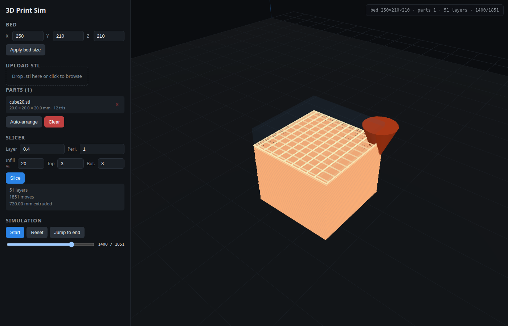
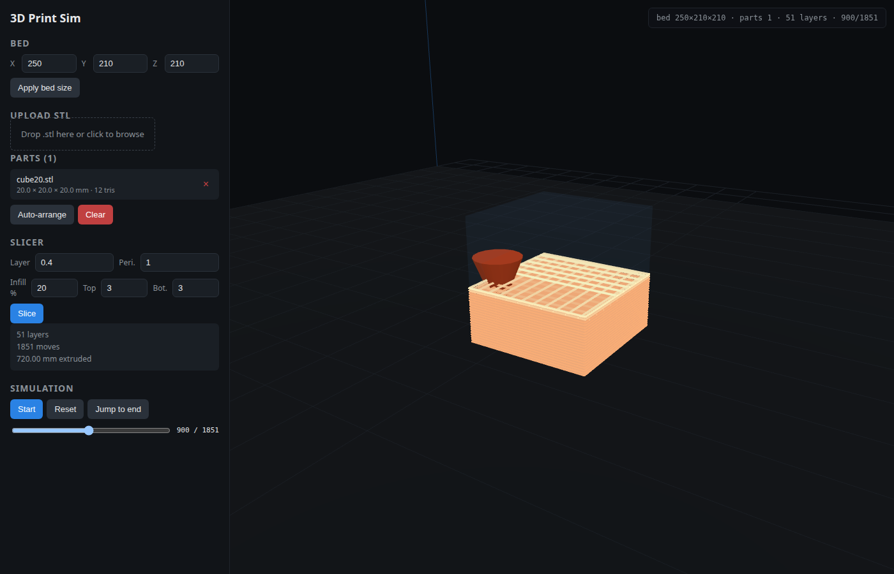
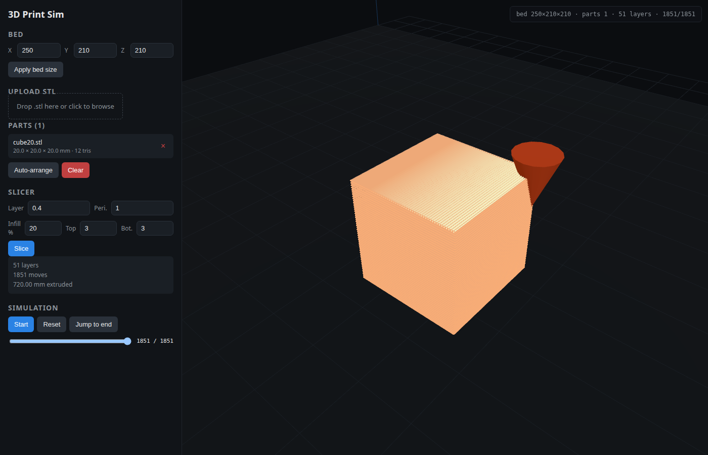
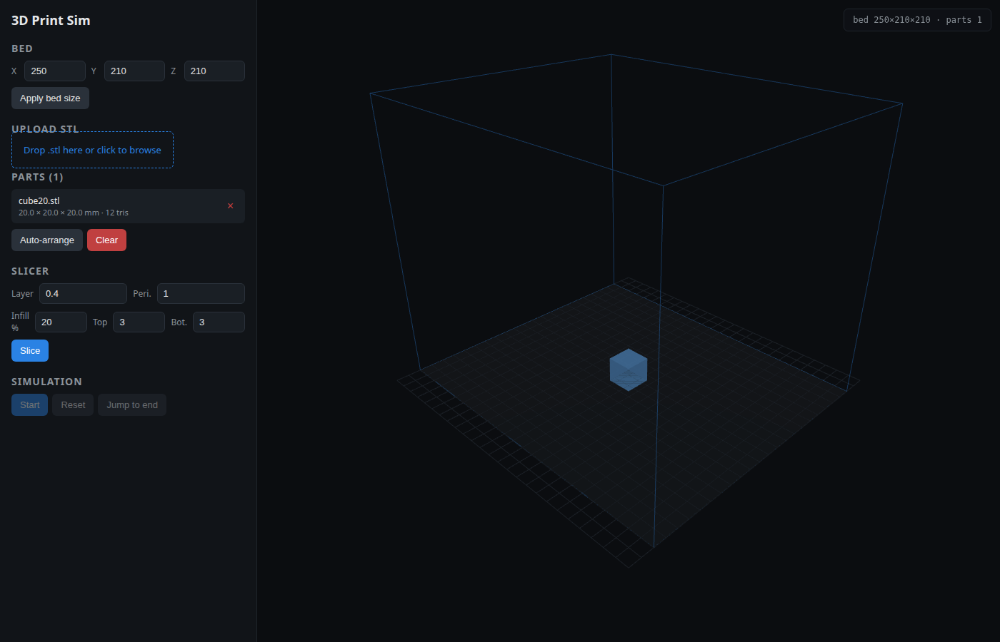
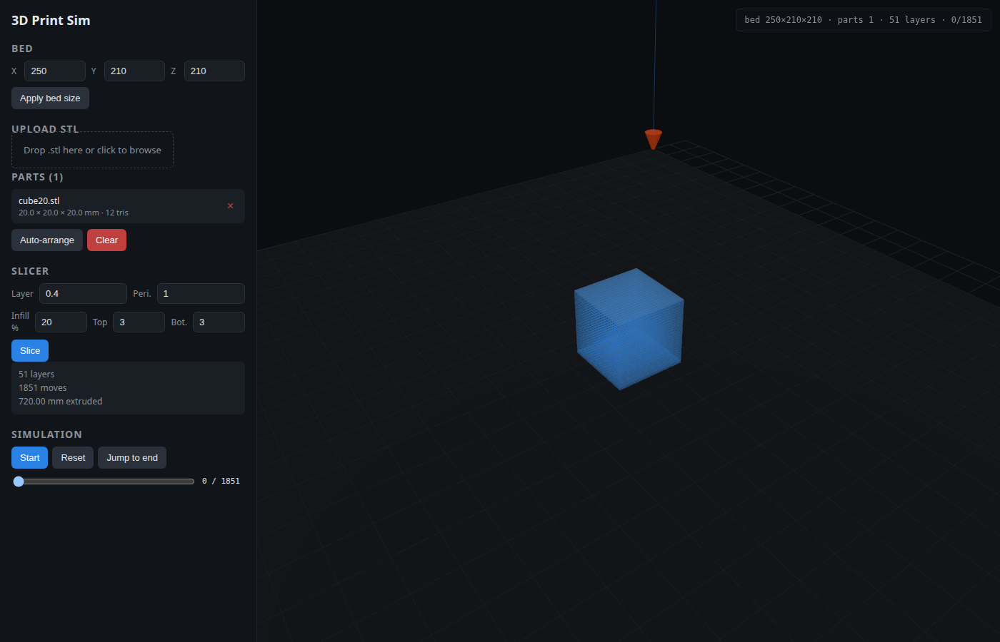
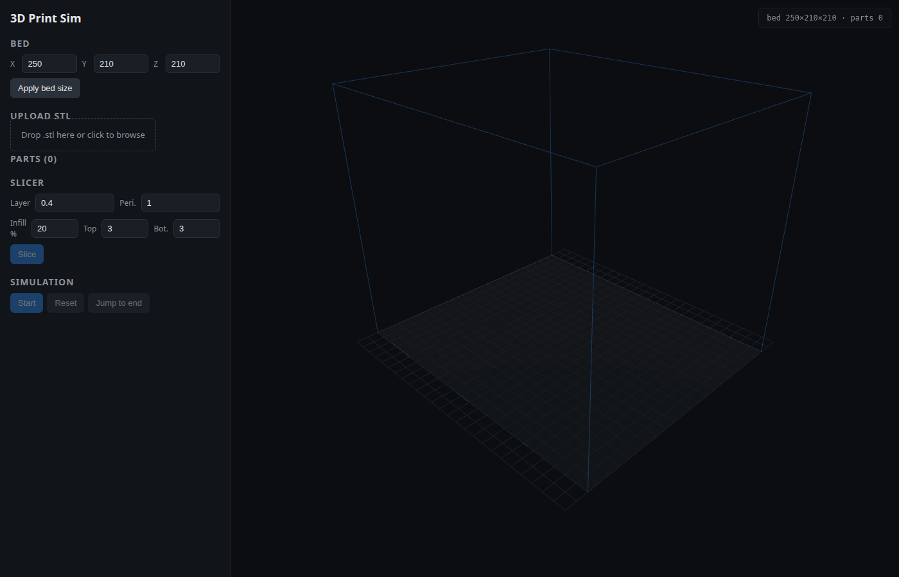

# 3dprintsim documentation

Everything you need to run, use, extend, and reason about the virtual FDM
printer. The top-level [`README`](../README.md) is a quickstart; this folder
goes deeper.

## Pages

| Page | What's in it |
|---|---|
| [`getting-started.md`](./getting-started.md) | First-run walkthrough with screenshots — upload, arrange, slice, simulate. |
| [`infill-and-render.md`](./infill-and-render.md) | What infill + solid top/bottom do, how the thick glowing toolpath renders, and how auto-centering works. |
| [`architecture.md`](./architecture.md) | How the backend, MCP server, and Three.js frontend share one printer. |
| [`slicer.md`](./slicer.md) | The Z-plane slicer algorithm and G-code generation. |
| [`api.md`](./api.md) | HTTP API reference with example `curl` calls. |
| [`mcp.md`](./mcp.md) | MCP tool surface and an example `fastmcp` client. |
| [`frontend.md`](./frontend.md) | Three.js scene, coordinate conventions, UI wiring. |
| [`development.md`](./development.md) | Local setup, tests, screenshot pipeline. |
| [`docker.md`](./docker.md) | Building and running the RHEL 9 container. |

## Screenshots

Every screenshot in this folder is from the live app, captured with Playwright.
`_capture_screenshots.mjs` regenerates the original tour (01–09); the feature
shots (10–15) were captured during the infill + glow-render work.

| Shot | What it shows |
|---|---|
|  | A mid-simulation print with thick glowing filament, visible infill grid on the current top, and the print head ready for the next layer. |
|  | About 900/1851 moves in — the hot-deposit gradient on the freshly-printed top is visible; ghost part mesh faintly shows the goal. |
|  | Full print complete — solid top-layer infill fills the final surface so there's no gap. |
|  | A freshly uploaded 20 mm cube, dropped straight onto the middle of a 250 × 210 bed (the placement's min-corner is (115, 95), so the cube is centered). |
|  | Slice panel after clicking **Slice** — 51 layers, 1851 moves, 720 mm of filament from 20% infill plus 3 solid top/bottom layers. |
|  | Initial app state. The new Slicer panel exposes `Infill %`, `Top`, and `Bot.` inputs. |

See [`getting-started.md`](./getting-started.md) for the narrated tour through
the original (01–09) pipeline shots, and [`infill-and-render.md`](./infill-and-render.md)
for detail on what each new feature does.
