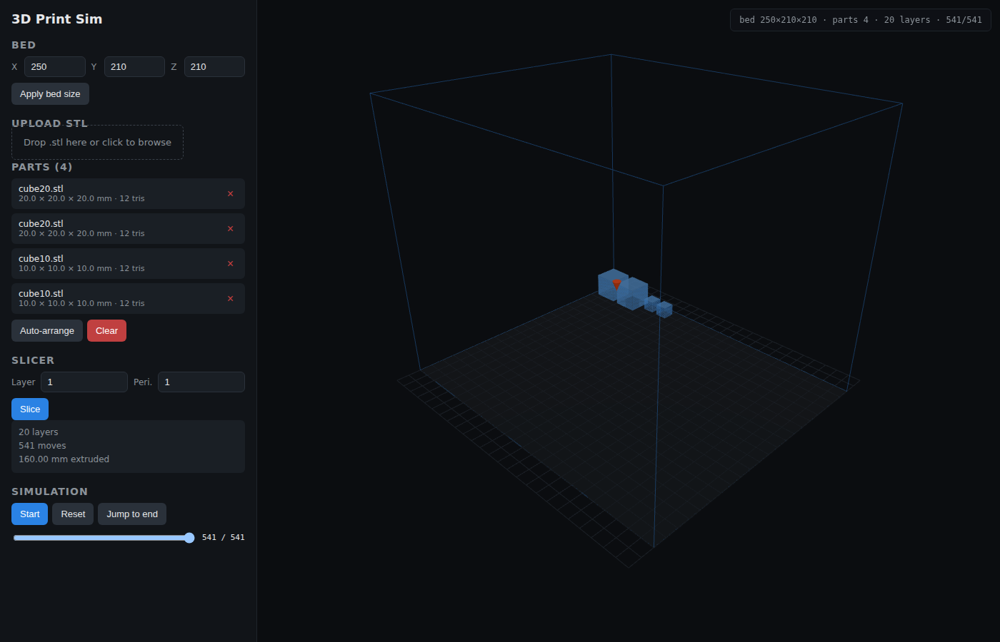

# 3dprintsim documentation

Everything you need to run, use, extend, and reason about the virtual FDM
printer. The top-level [`README`](../README.md) is a quickstart; this folder
goes deeper.

## Pages

| Page | What's in it |
|---|---|
| [`getting-started.md`](./getting-started.md) | First-run walkthrough with screenshots — upload, arrange, slice, simulate. |
| [`architecture.md`](./architecture.md) | How the backend, MCP server, and Three.js frontend share one printer. |
| [`slicer.md`](./slicer.md) | The Z-plane slicer algorithm and G-code generation. |
| [`api.md`](./api.md) | HTTP API reference with example `curl` calls. |
| [`mcp.md`](./mcp.md) | MCP tool surface and an example `fastmcp` client. |
| [`frontend.md`](./frontend.md) | Three.js scene, coordinate conventions, UI wiring. |
| [`development.md`](./development.md) | Local setup, tests, screenshot pipeline. |
| [`docker.md`](./docker.md) | Building and running the RHEL 9 container. |

## Screenshots

Every screenshot in this folder is generated by
[`_capture_screenshots.mjs`](./_capture_screenshots.mjs) driving the real UI
with Playwright. To regenerate them see [`development.md`](./development.md#regenerating-screenshots).

See [`getting-started.md`](./getting-started.md) for the full narrated tour.
