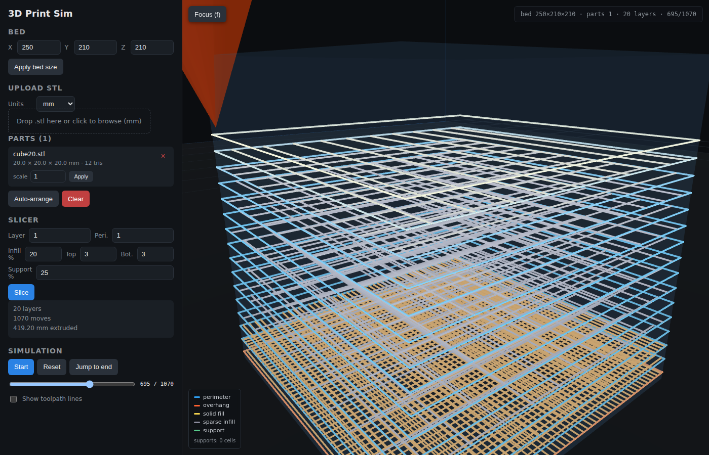
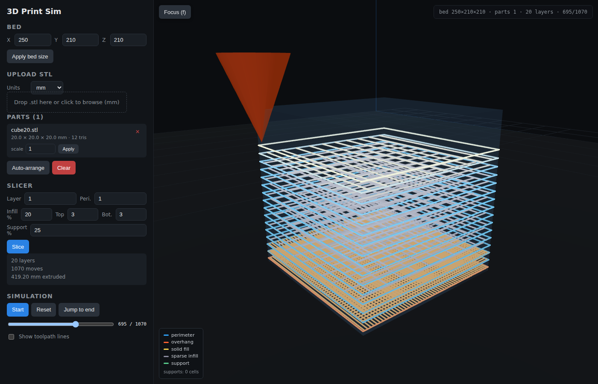

# Depth visualization

The original simulator rendered every extrude segment in the same orange
color. At any camera angle where the layers weren't parallel to the screen,
the whole print collapsed into a single silhouette — the "orange blob"
problem:

> this is an example where the 3d simulated print just looks like an orange blob

The fix is a two-axis color scheme: **role on one axis, Z height on the
other**. Both signals are applied at the same time and both are legible
from any angle.



## Role axis

Each move the slicer emits carries a `role` field (see
[`surfaces-and-supports.md`](./surfaces-and-supports.md) for how roles are
assigned). The viewer looks the role up in `ROLE_BASE` in
[`frontend/src/PrinterScene.js`](../frontend/src/PrinterScene.js):

```js
const ROLE_BASE = {
  perimeter:          [0.18, 0.62, 0.95],   // cool blue — walls
  overhang_perimeter: [1.00, 0.38, 0.18],   // hot orange — unsupported edges pop
  infill_sparse:      [0.55, 0.55, 0.62],   // dim grey — interior lattice
  bottom:             [0.95, 0.55, 0.20],   // amber — bottom/overhang fills
  top:                [0.85, 0.90, 0.45],   // pale yellow-green — ceilings
  support:            [0.35, 0.80, 0.55],   // muted green — easy to subtract visually
};
```

The palette is deliberately split: **cool = structural** (walls, ceilings),
**warm = load-bearing bottom** (overhang fill, overhang perimeter),
**neutral = disposable** (sparse infill, support). You can read at a glance
what the printer is doing without checking the legend.

A legend in the bottom-left of the viewer lists every role that can appear
in the current toolpath plus the support cell count:



## Z-height axis

On top of the role color, each segment's base color is biased by the
segment's Z height within the toolpath:

```js
const zNorm = Math.max(0, Math.min(1, (s.z - zMin) / zRange));
const shift = zNorm - 0.5;                         // [-0.5, +0.5]
const liftAmt = shift > 0 ? shift * 2 * DEPTH_LIGHTEN : 0;
const sinkAmt = shift < 0 ? -shift * 2 * DEPTH_DARKEN : 0;
let r = base[0] * (1 - sinkAmt) + (1 - base[0]) * liftAmt;
// same for g and b
```

- `shift ∈ [-0.5, +0.5]` so mid-layers stay on their role color (unshifted)
  and only the ceiling/floor get a visible tint.
- `liftAmt` pushes toward white (higher layers appear lighter).
- `sinkAmt` pushes toward black (lower layers appear darker).
- The limits (`DEPTH_LIGHTEN = 0.35`, `DEPTH_DARKEN = 0.30`) keep the
  shift below where it would obliterate the role identity.

The combined effect: two cubes printed side by side still look like two
cubes (same role palette) but you can see the bottom layers are darker and
the top layers brighter, so the shape is unambiguous from any camera.

## Hot-tip glow

The last `GLOW_SEGMENTS = 40` extrude segments keep the original
just-extruded glow — their color is blended toward `HOT_COLOR = [1.0, 0.98, 0.75]`
(near-white) so the user can always see where the simulated head is.
The blend strength falls off linearly over the glow window, so old
segments settle back into their role-plus-depth color.

## Source mesh context

During simulation the viewer used to hide the translucent source mesh
entirely. That removed the one easy shape cue and left the print looking
like floating lines. The viewer now keeps the mesh visible at low opacity
(12% during sim, 35% at cursor=0) so the eye has a reference silhouette
even when only the bottom few layers are deposited.

## Acceptance check

`tests/e2e/visual.spec.js` exercises the scheme:

- `toolpath color buffer uses more than one unique color` samples the
  LineSegments2 instance color buffer for the simple cube case. Even the
  simplest part gets at least four distinct swatches (perimeter, solid top,
  sparse middle, hot tip).
- `overhang part reports support cells and solid fill` uses the T-shape
  fixture to confirm the viewer can actually display a diverse palette when
  supports and overhangs are in play.
