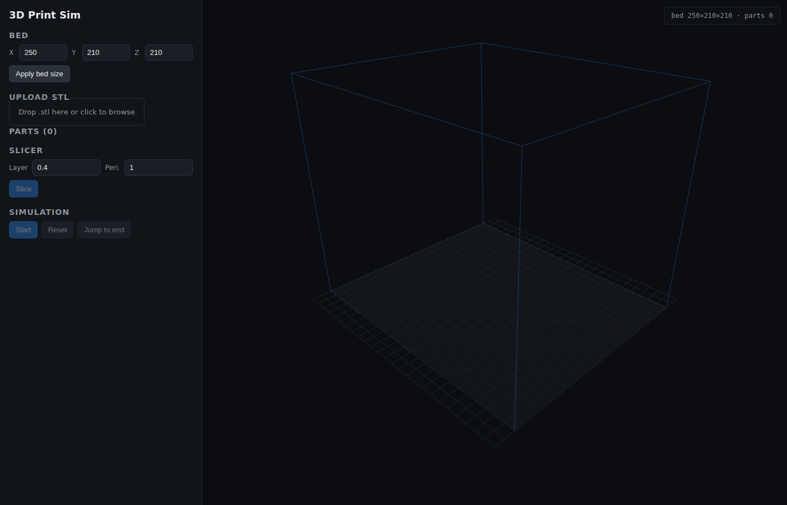
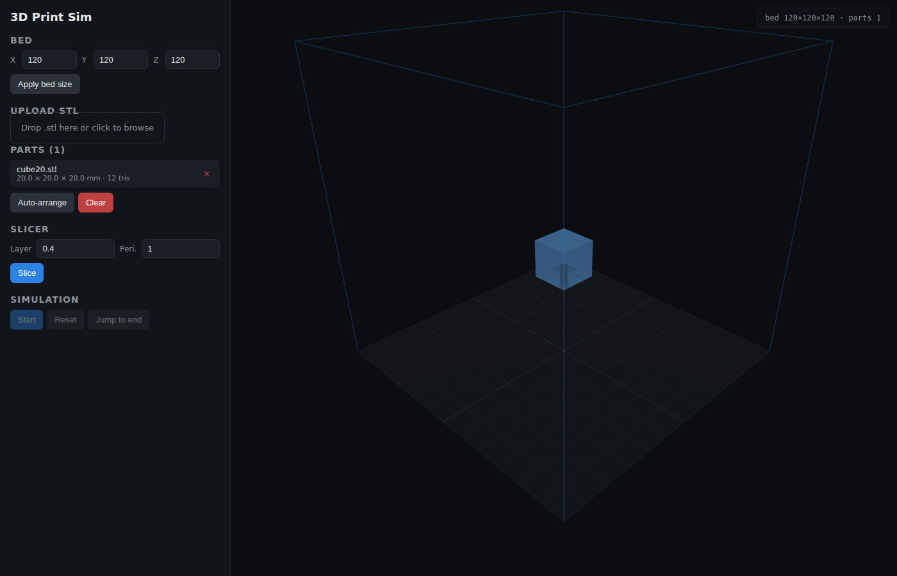
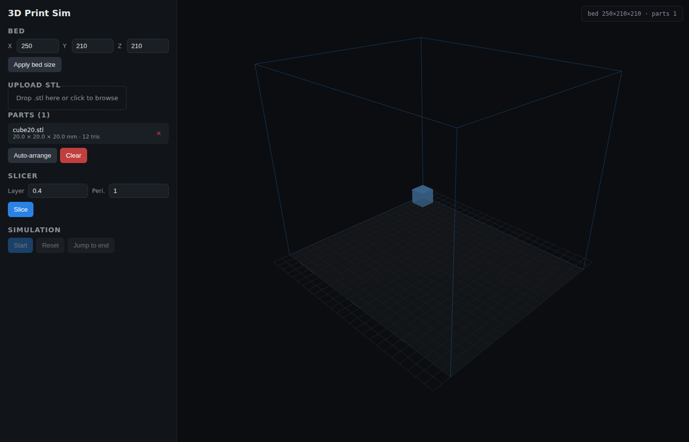
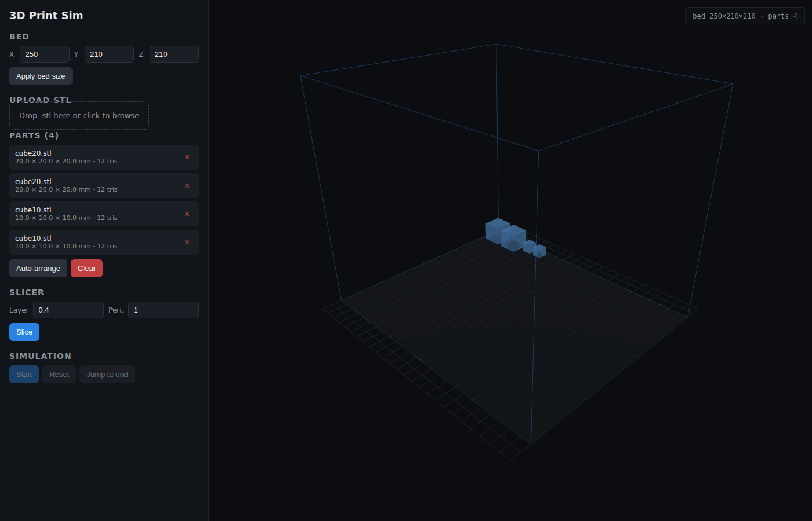
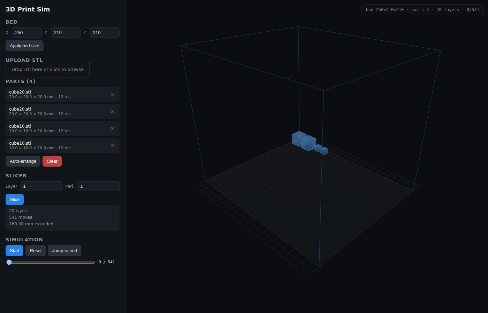
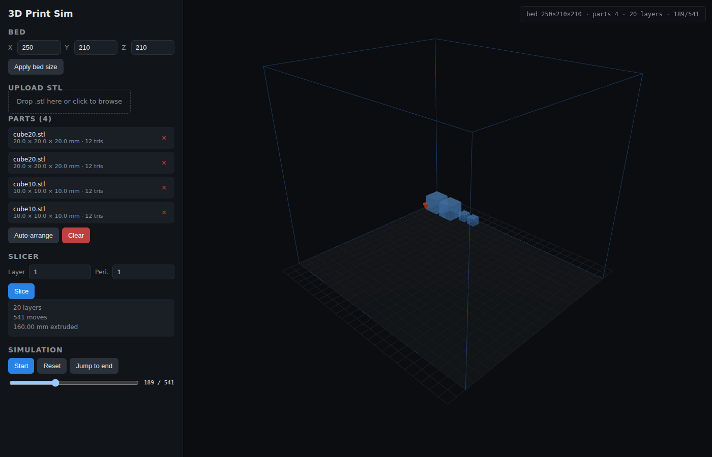
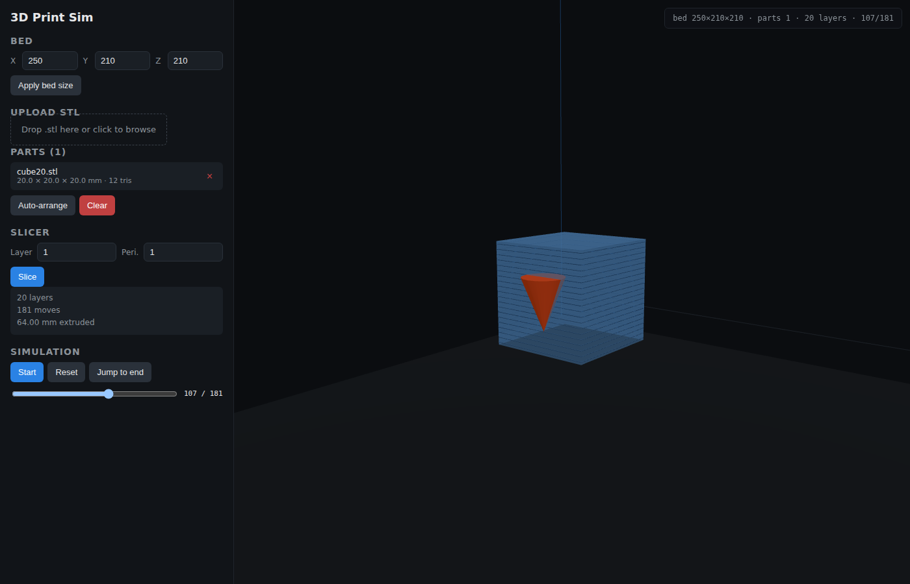
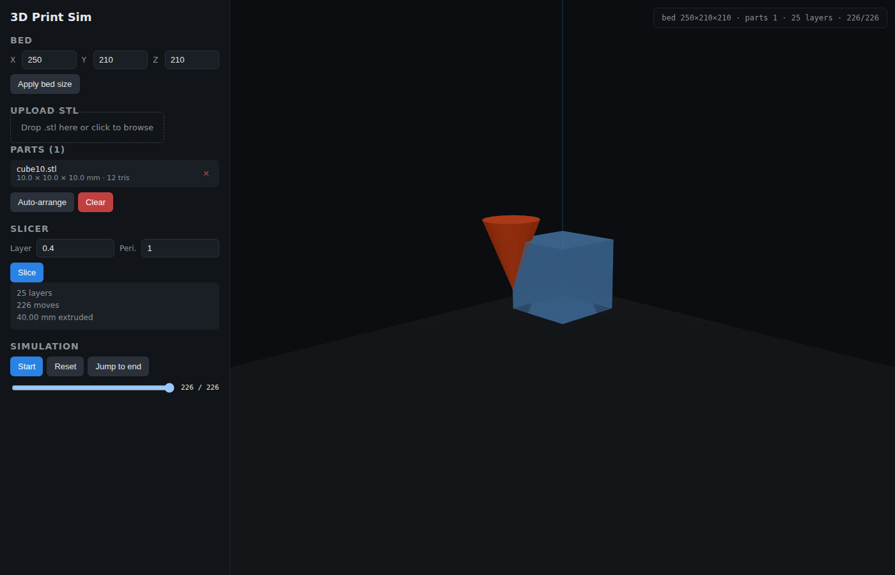

# Getting started

A narrated walkthrough of the UI, end to end. Every image on this page was
captured against the real app.

## 1. The empty printer

On first load you see the default Prusa i3 MK3S+ build volume (250 × 210 ×
210 mm) as a wireframe box with the bed plate at the bottom. The sidebar on
the left drives all state; the right pane is the 3D viewer.

You can change the bed before uploading anything — type new X/Y/Z and hit
**Apply bed size**. The viewer re-centers on the new volume immediately.

## 2. Uploading an STL

Drop an `.stl` file on the dropzone, or click to pick one. The file is posted
to `POST /api/parts/upload`; the backend parses triangles, computes the AABB,
and returns part metadata. The UI then auto-arranges on every upload so new
parts don't pile up at the origin.

Parts appear in the left-hand list with dimensions and triangle count:

Upload more parts and hit **Auto-arrange** (or keep uploading — each upload
re-arranges everything). The shelf packer places widest-first, wrapping to
new rows when the current row overflows. See [`slicer.md`](./slicer.md) and
[`architecture.md`](./architecture.md) for the algorithms.

## 3. Slicing

Set **Layer** (mm) and **Peri.** (perimeter passes per loop) then click
**Slice**. The status panel reports layer count, total move count, and
cumulative extrusion length. The ghost of the entire toolpath is drawn in
dim blue lines over the parts.

Behind the scenes each layer intersects every triangle that spans `Z` and
chains the resulting segments into closed polygons, then emits a G-code-style
toolpath that traces each polygon once per perimeter. Details in
[`slicer.md`](./slicer.md).

## 4. Simulating the print

Click **Start** to animate the print head (orange cone) along the toolpath.
The slider under the buttons is a live scrubber — drag it to jump to any
cursor position; playback pauses while you scrub.

Mid-print, you can see filament lines already extruded (bright orange) and
the print head working on the current layer:

Close-up of the head on a single cube, scrubbed past the halfway mark. The
bright orange layer lines are what's been "extruded" so far; the dim lines
ahead of the head are the ghost of remaining moves:

**Jump to end** rushes the simulation to the final move. The finished part
shows every extruded perimeter line, stacked layer by layer, with the head
parked on top:

## 5. End of the line

Hit **Reset** to rewind the cursor to 0 without re-slicing. Change layer
height and re-slice to produce a new toolpath — the scene re-renders
instantly.

From here: read [`architecture.md`](./architecture.md) for the shape of the
system, [`api.md`](./api.md) / [`mcp.md`](./mcp.md) to drive the printer from
code, or [`development.md`](./development.md) to start hacking.
