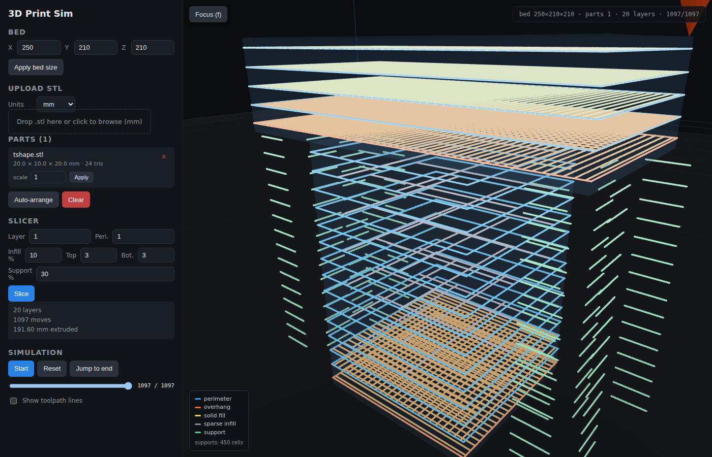

# Surfaces and supports

The slicer's infill decisions used to be "first N layers = solid bottom, last
N layers = solid top, everything else = sparse." That's enough for a cube but
misses the two things users actually ask about when the print comes out
looking wrong:

- **Intermediate bottom surfaces** — the underside of a cap, shelf, or
  bridge at mid-height of the part.
- **Overhangs that need supports** — the cap of a T, the crossbar of an H,
  any feature that extends outside the layer below it.

This page documents how the current pipeline detects those situations and
what it generates in response.



## The raster mask stack

For each mesh, every layer's 2D contours are rasterized onto a shared
integer grid (default 2 mm — see
[`app/surfaces.py`](../backend/app/surfaces.py) for the implementation). The
result is a list of `frozenset[Cell]` where each `Cell` is a `(col, row)`
tuple. Because every layer uses the same grid, comparing "is this cell
solid at layer L vs layer L-1?" is just set membership.

```text
layer_masks = [
    frozenset({(50, 50), (50, 51), ...}),   # layer 0
    frozenset({(50, 50), (50, 51), ...}),   # layer 1
    ...
]
```

Resolution trades accuracy for memory; 2 mm catches the overhangs a hobbyist
printer cares about (the narrowest support a 0.4 mm nozzle can realistically
bridge is ~3–5 mm) while keeping the grid for a 250×210×210 mm bed under
1e4 cells per layer.

## Classifications

All four classifiers live in `surfaces.py` and take the full mask stack
plus a layer index.

| Call | What cells are returned |
|---|---|
| `rasterize_polygons(polys, res)` | Cells whose center is inside any closed polygon in this layer |
| `overhang_cells(current, previous)` | `current - previous` — cells that newly appeared at this layer |
| `top_surface_cells(masks, L, top_layers)` | Cells in `mask[L]` that have void somewhere in the next `top_layers` above |
| `bottom_surface_cells(masks, L, bottom_layers)` | Cells in `mask[L]` that have void somewhere in the previous `bottom_layers` below |
| `compute_support_cells(masks)` | Per-layer sets of cells that need a support column, walked down from each overhang |

The **top/bottom** functions return the current layer minus the intersection
of the window above/below. That intersection only contains cells that are
solid the whole way — so subtracting it leaves exactly the cells that border
a void. If the window runs past either end of the model, the whole layer
counts as a top/bottom surface.

## What the slicer does with them

In `slicer.slice_meshes()` (see [`slicer.md`](./slicer.md) for the full
pipeline), a per-mesh per-layer decision runs for every emitted layer:

1. Compute `here = mask[L]`, `below = mask[L-1]`, `overhang = here - below`.
2. Compute `top_cells` and `bot_cells` from the new classifiers.
3. `solid_cells = top_cells | bot_cells | overhang` — the union of everything
   that wants tight (100%) infill at this layer.
4. If `overhang` is non-empty, emit **one extra perimeter** around the
   contour. This matches the "extra perimeters on overhangs" option that
   PrusaSlicer defaults to — more material to bridge with.
5. If `len(solid_cells)` is a meaningful fraction of the layer (≥ 1/3 of
   cells, or any overhang at all), the layer uses tight rectilinear infill
   at nozzle-width spacing. Otherwise sparse infill at
   `nozzle_width / infill_density` spacing, as before.
6. For each support cell at this layer, emit a short stub (half-cell long)
   at the cell center. Cells are sub-sampled by `support_density` so lower
   densities leave visible gaps.

## Support generation

`compute_support_cells()` walks the mask stack layer-by-layer:

```text
for L in 1..len(masks):
    new = mask[L] - mask[L-1]             # cells that appeared at L
    for cell in new:
        for z in L-1 .. 0:
            if cell in mask[z]: break      # stop when ground meets
            support[z].add(cell)           # otherwise, column cell
```

Key properties:

- **Walks stop at the first solid layer.** A T-shape sitting on a column
  only generates supports in the air gap under the cap, not all the way
  to the bed when the column is in the way.
- **No duplicate work.** A 20×10 cap above a 4×4 stem generates one support
  column per uncovered cap cell — all of them land in the same empty
  `support[z]` set, so shared pillars merge naturally.
- **Concave parts are handled.** The inside of a cup is computed the same
  way — at the mid-layer where the wall turns inward, the inner floor is
  a bottom-surface cell and gets solid infill; nothing below needs support
  because `mask[L-1]` already contains those cells.

## Move roles

Every extrude move is tagged with a `role` so the viewer can render the
toolpath in a way that's actually readable:

| Role | When | Viewer color |
|---|---|---|
| `perimeter` | Standard outer wall trace | Blue |
| `overhang_perimeter` | Extra perimeter added on overhang layers | Hot orange |
| `infill_sparse` | Sparse rectilinear fill (mid-layers, not an overhang) | Grey |
| `top` | Solid fill at top-surface cells | Pale yellow-green |
| `bottom` | Solid fill at bottom-surface or overhang cells | Amber |
| `support` | Auto-generated support stubs | Muted green |
| `travel` | Non-extrude move | Not drawn |

See [`depth-visualization.md`](./depth-visualization.md) for how these
roles feed the color ramp.

## Parameters

| Slicer param | Default | What it does |
|---|---|---|
| `top_layers` | 3 | Look-ahead window for top-surface detection |
| `bottom_layers` | 3 | Look-behind window for bottom-surface detection |
| `infill_density` | 0.2 | Sparse infill ratio in non-solid layers |
| `support_density` | 0.25 | 0..1 — 0 disables supports entirely |

From the MCP side, the same knobs are exposed on `slice_all`:

```python
await client.call_tool("slice_all", {
    "layer_height_mm": 0.2,
    "perimeters": 2,
    "infill_density": 0.2,
    "top_layers": 3,
    "bottom_layers": 3,
    "support_density": 0.3,
})
```

## Tests

- Unit coverage for every classifier and the support walk-down is in
  [`backend/tests/test_surfaces.py`](../backend/tests/test_surfaces.py).
- End-to-end: `tests/e2e/visual.spec.js` uploads the T-shape fixture,
  slices with supports on, and asserts `support_cell_count > 0` plus at
  least one `support`-role move in the toolpath.
